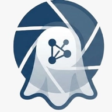

  
  <h1>Synchronicity: GhostView</h1>
  
<strong>A Paradigm Shift in High-Security Media Communication</strong>

  
<em>Developed for Synchronicity Hackathon 2026 S2</em>

---

## 🏆 Open Innovation Track
While traditional secure messengers (like Signal or WhatsApp) rely purely on software-layer restrictions (e.g., disabling OS screenshots), GhostView pioneers **"physical-context security."** By utilizing edge-to-cloud Computer Vision (YOLOv8 and MediaPipe) to actively scan the physical environment for shoulder-surfers and secondary recording devices (smartphones), it permanently closes the **"Analog Hole"**—the critical vulnerability of physically photographing a screen to steal sensitive data.

## 🚀 Key Features

* **GhostView Secure Media Viewer:** A high-security "View Once" media viewer that blocks native OS screenshots via `FLAG_SECURE`.
* **Anti-Snooping (Shoulder Surfing Protection):** Background CameraX streams analyze the user's environment in real-time. If multiple faces are detected, the media is instantly blurred and blocked.
* **Anti-Camera (Screen Recording Protection):** If a smartphone is pointed at the screen to illegally capture a picture, the YOLO AI model detects the phone and triggers a dynamic privacy blackout warning.
* **Real-time Encrypted Messaging:** Firebase-backed full chat infrastructure for text, standard media, and secure "One-Time" media.
* **Encrypted Calls:** Call logs and secure encrypted handshake audio/video call initialization logic.

## 🛠️ Technology Stack

* **Frontend:** Kotlin, Jetpack Compose, Coil, CameraX, ML Kit Face Detection.
* **Backend:** Firebase Firestore (NoSQL, Real-time messaging), Cloudinary (Media hosting).
* **AI Computer Vision Server:** Python, Flask, Ultralytics YOLOv8, Google MediaPipe, OpenCV, NumPy.

---

## 📥 Download the App
Test our solution live! Download the compiled `.apk` from our official Google Drive repository:
🔗 **[Download GhostView APK](https://drive.google.com/drive/u/0/folders/1Jx0ReZSPCiYxyltMW56y3ZZ_z_U6WJrb)**

---

## 👥 Contributors & Team Members

We are proud to present our solution for the **Synchronicity Hackathon 2026 S2**.

| Name | Phone Number |
| :--- | :--- |
| **Raunak Biswas** | +91 7629977676 |
| **Asmit Biswas** | +91 8981788530 |
| **Rajdeep Das** | +91 7439121680 |
| **Dipram Biswas** | +91 9232696735 |

---
*Built with ❤️ for Synchronicity 2026*
